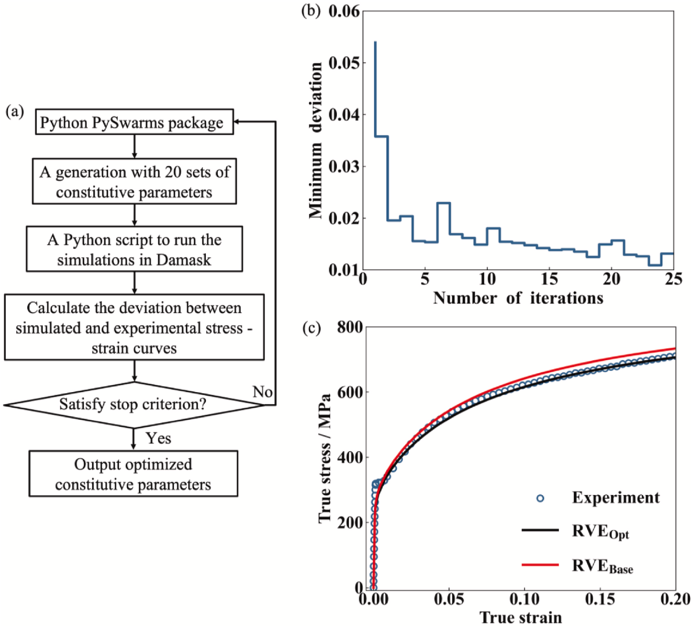

# PSO-DAMASK Calibration of Crystal Plasticity Parameters for AISI 420 Steel

This repository contains a Python workflow for calibrating crystal plasticity constitutive parameters using particle swarm optimization (PSO) for DAMASK full-field simulations. The workflow is designed for a multiphase representative volume element (RVE) of annealed AISI 420 stainless steel, where the ferritic matrix and carbide phase are described by separate material phase files.

The detailed scientific background, modeling assumptions, and validation strategy are described in the published article:

> K. Lu, Y. Zhou, S. Solhjoo, M. Naghinejad, R. van Tijum, Y. T. Pei, and J. Post, "Investigating carbide characteristics effect on multiscale mechanical behavior of AISI 420 steel using crystal plasticity simulation," *Journal of Materials Research and Technology*, vol. 36, pp. 10487-10506, 2025. DOI: [10.1016/j.jmrt.2025.05.235](https://doi.org/10.1016/j.jmrt.2025.05.235)

## Calibration Workflow



The main idea is to search for ferrite crystal plasticity parameters that minimize the deviation between simulated and experimental stress-strain curves. Each PSO particle represents one candidate set of constitutive parameters. For every candidate, the notebook updates the DAMASK material file, runs a DAMASK grid simulation, extracts the average RVE response, and computes the normalized difference from the experimental tensile curve.

## Repository Contents

| File | Description |
| --- | --- |
| `PSO-ConstitutiveParaOptimization.ipynb` | Main calibration notebook. It builds the DAMASK geometry/material/load case, runs PSO, launches DAMASK simulations, logs parameters, appends simulated curves, and computes errors. |
| `PlotError.ipynb` | Post-processing notebook for plotting optimization convergence and comparing the best simulated stress-strain curve with the experimental curve. |
| `Stress_strain.csv` | Stress-strain database. The first two columns are the experimental data, and each simulated curve is appended as a new strain/stress column pair. |
| `RealRVE_1.dream3d` | DREAM.3D microstructure file used to generate the DAMASK grid and material configuration. |
| `material_phase_Ferrite.yaml` | Ferrite phase definition. The PSO loop modifies selected plasticity parameters in this phase. |
| `material_phase_Carbide.yaml` | Carbide phase definition. This phase is kept fixed during the current calibration workflow. |
| `assets/SchematicCallibration.png` | Schematic figure showing the PSO-DAMASK calibration loop and representative optimization results. |

## Optimized Parameters

The PSO search is applied to four ferrite plasticity parameters in DAMASK's `phenopowerlaw` model:

| Parameter | Meaning | Unit |
| --- | --- | --- |
| `h_0_sl-sl` | Initial slip-slip hardening modulus | Pa |
| `a_sl` | Hardening exponent | Dimensionless |
| `xi_inf_sl` | Saturation slip resistance | Pa |
| `xi_0_sl` | Initial slip resistance | Pa |

In the optimizer vector, the parameter order is:

```text
[h_0_sl-sl, a_sl, xi_inf_sl, xi_0_sl]
```

## Method Summary

1. Load the RVE microstructure from `RealRVE_1.dream3d`.
2. Export a DAMASK grid as `geometry.vti`.
3. Load ferrite and carbide phase definitions from YAML files.
4. Define the uniaxial loading condition in `load.yaml`.
5. Interpolate the experimental stress-strain curve from the first two columns of `Stress_strain.csv`.
6. Generate a PSO population of candidate ferrite constitutive parameters.
7. For each PSO particle, update the ferrite parameters in `material.yaml`.
8. Run the simulation for the current parameter set.
9. Extract volume-averaged von Mises stress and strain from `geometry_load.hdf5`.
10. Append the simulated curve to `Stress_strain.csv`.
11. Compute the relative L2 deviation from the experimental curve.
12. Repeat until the target error or maximum number of PSO iterations is reached.

## Requirements

The workflow requires:

- Python 3
- Jupyter Notebook or JupyterLab
- DAMASK3.0.0a7
- MPI support, for example `mpiexec`
- Python packages:
  - `damask`
  - `h5py`
  - `numpy`
  - `pandas`
  - `matplotlib`
  - `scipy`
  - `pyswarms`

## Generated Output Files

The workflow creates or updates the following files during execution:

| Output file | Created by | Description |
| --- | --- | --- |
| `geometry.vti` | `PSO-ConstitutiveParaOptimization.ipynb` | DAMASK grid geometry generated from `RealRVE_1.dream3d`. |
| `material.yaml` | `PSO-ConstitutiveParaOptimization.ipynb` | DAMASK material configuration. The Ferrite phase parameters are updated for each PSO particle. |
| `load.yaml` | `PSO-ConstitutiveParaOptimization.ipynb` | DAMASK mechanical loading file for the uniaxial deformation-rate simulation. |
| `geometry_load.hdf5` | `DAMASK_grid` | DAMASK result file for the latest simulated parameter set. It is overwritten by each new run. |
| `Param.csv` | `PSO-ConstitutiveParaOptimization.ipynb` | Complete parameter history. One row corresponds to one DAMASK simulation. |
| `Error.csv` | `PSO-ConstitutiveParaOptimization.ipynb` | Complete error history. One row corresponds to one DAMASK simulation. |
| `Stress_strain.csv` | `PSO-ConstitutiveParaOptimization.ipynb` | Existing input file that is updated in place. Each simulation appends one `epsilon_N` / `sigma_N` curve pair. |
| `Error.png` | `PlotError.ipynb` | Minimum deviation versus PSO iteration. |
| `Iterations.png` | `PlotError.ipynb` | Best simulated stress-strain curve compared with the experimental curve. |

## Citation

If you use this calibration workflow or adapt it for related CP-RVE simulations, please cite:

```bibtex
@article{Lu2025AISI420CP,
  title = {Investigating carbide characteristics effect on multiscale mechanical behavior of AISI 420 steel using crystal plasticity simulation},
  author = {Lu, Kegu and Zhou, Yadong and Solhjoo, Soheil and Naghinejad, Maysam and van Tijum, Redmer and Pei, Yutao T. and Post, Jan},
  journal = {Journal of Materials Research and Technology},
  volume = {36},
  pages = {10487--10506},
  year = {2025},
  doi = {10.1016/j.jmrt.2025.05.235}
}
```
